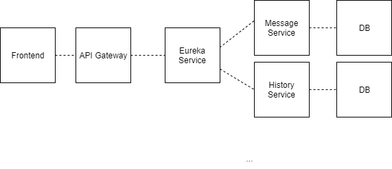

# Projekt Czatu

Koncepcja systemu:

Cel projektu: Stworzenie rozproszonego systemu obsługującego grupowy czat wraz z logowaniem aktywności klientów. 

Lista wymagań:
Klient jest w stanie się zarejestrować.
Klient jest w stanie się zalogować.
Klient jest w stanie dołączyć do grupowego czatu.
Klient jest w stanie odebrać wiadomości.
Klient jest w stanie wysłać wiadomości.

Główni aktorzy w systemie
- System.
- Klient.

Propozycja architektury

Stos technologiczny:
- Backend: Java + Spring
- Frontend: Javascript + React
- Konteneryzacja: Docker
- Zarządzenie Kontenerami: Kubernetes

Analiza wymagań
Wymagania funkcjonalne i niefunkcjonalne - specyfikacja
- Wymagania niefunkcjonalne:
System musi być wydajny. 
System musi być skalowalny.

- Wymagania funkcjonalne:
System loguje aktywność użytkowników (logowanie oraz wysłanie wiadomości).
System autoryzuje użytkowników.
System umożliwia rejestracje użytkowników.
TODO

Przypadki użycia
TODO

Diagramy klas, komponentów, sekwencji
TODO

Struktura danych
TODO

Planowane testy
- Jednostkowe
- Integracyjne
- e2e

Roadmap:
Zjazd 3:
- Uzupełnienie dokumentacji.
- Wstępny prototyp system - frontend

Zjazd 4:
- Backend
- Rejestracja + logowanie użytkowników

Zjazd 5: 
- Logowanie aktywności

Zjazd 6:
- Testy

Zjazd 7: 
- Oddanie projektu